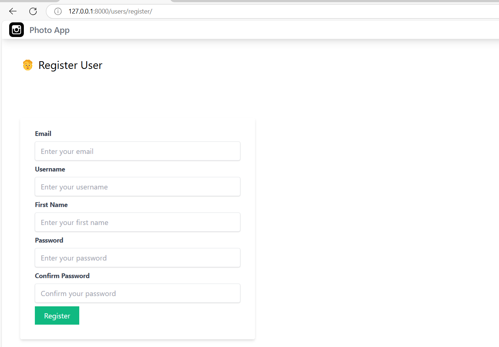
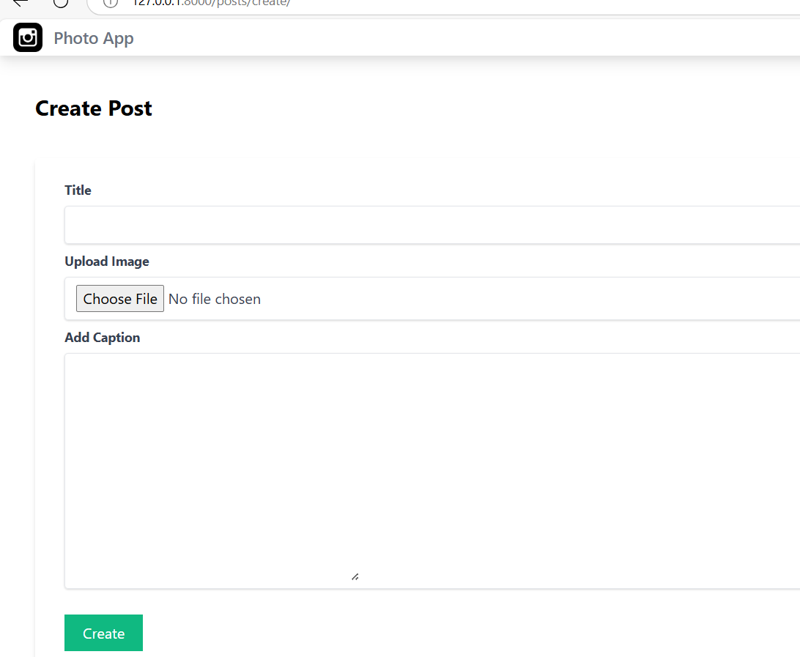
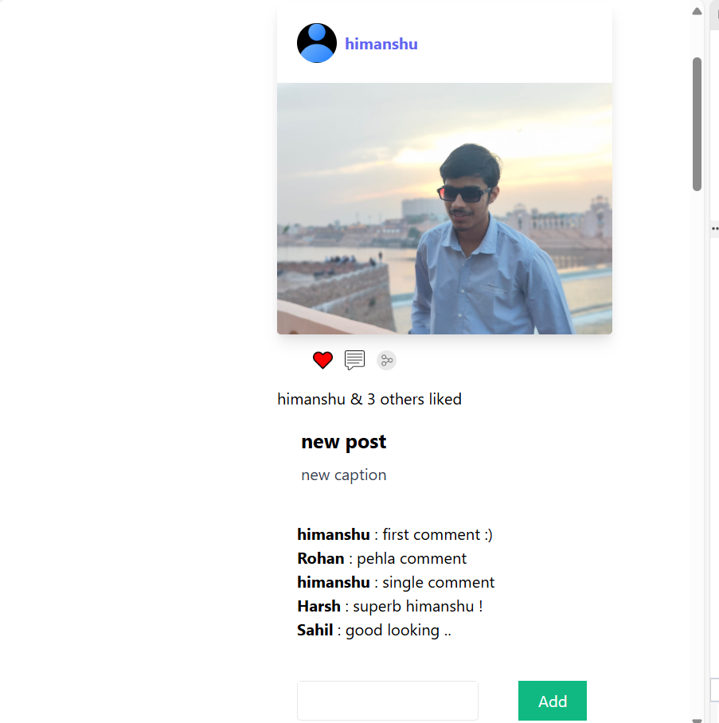
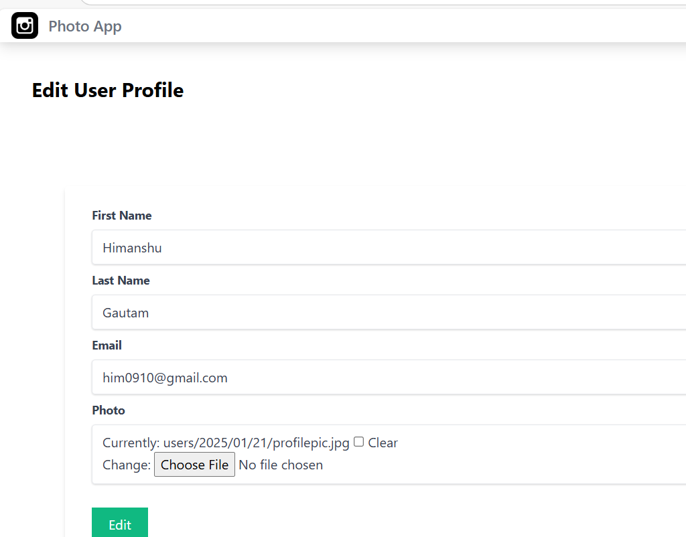
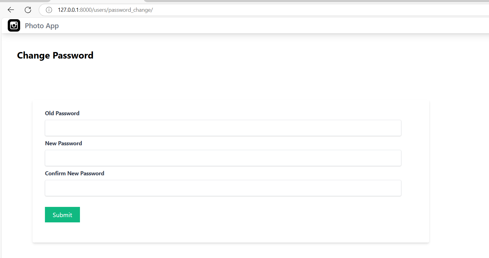
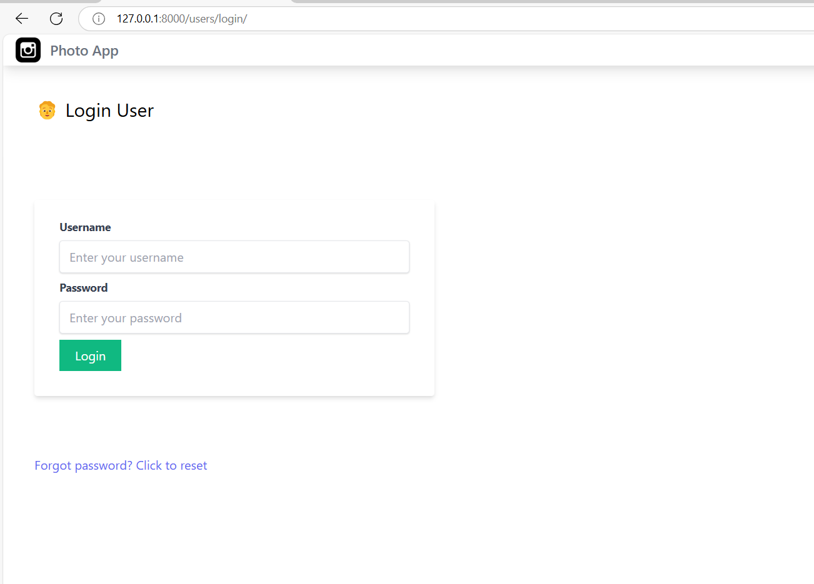
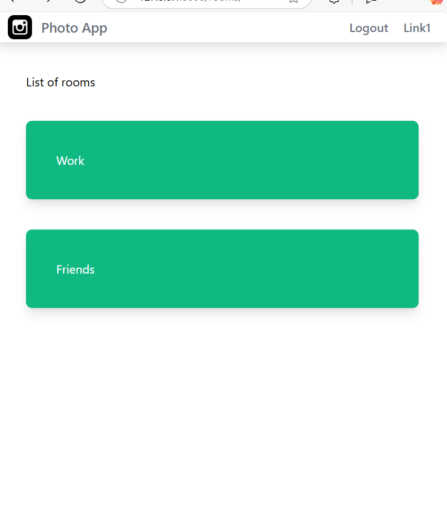
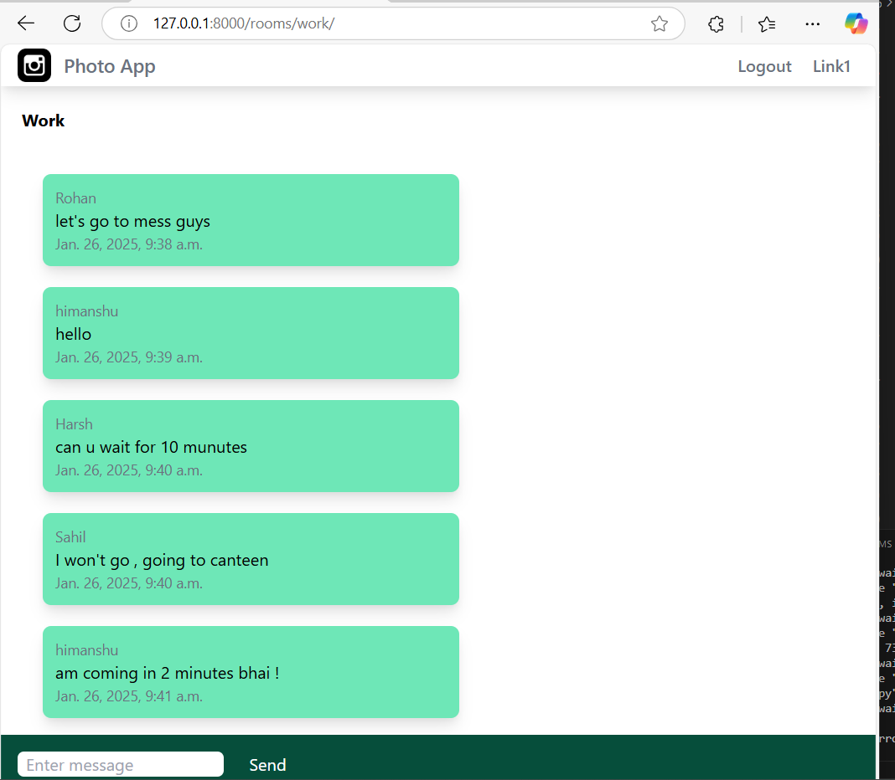

# Django Web App: Multi-User Social Platform

## 🌟 Overview

This project is a feature-rich **Django Web Application** designed to provide a seamless user experience for **registration**, **authentication**, and a **social feed** with interactive functionalities. It allows users to register, log in, log out, and manage their profiles while offering the ability to create posts with images and captions, like and comment on posts, and view an engaging feed of posts by all users.

The application is styled using **Tailwind CSS** for a modern and responsive design and leverages **AJAX** for dynamic interactions like liking posts without page reloads. It also uses Django ORM for efficient database management. Furthermore, **real-time chat functionality** has been implemented using **Django Channels**, enabling users to create rooms and send messages visible to other room participants.

---

## 🚀 Key Features

### 1. **User Authentication and Profile Management**
- **User Registration**: New users can register and create an account.
- **Login/Logout**: Secure login and logout functionalities.
- **Change Password**: Users can change their password after logging in.
- **Reset Password**: Forgot password functionality via email.
- **User Profile**:
  - Extends the default user model with a **Profile Model**.
  - Users can upload a **profile picture**.
  - Profiles are editable and include personal details.

### 2. **Post Creation and Interaction**
- **Create Posts**:
  - Users can create posts with a title, caption, and an optional image.
  - Posts are stored in a separate database table with a **many-to-one relationship** to the user.

- **Feeds Page**:
  - Displays posts from all users.
  - Includes the post image, title, caption, and author details.

- **Like and Comment**:
  - Users can like posts dynamically using **AJAX**.
  - The number of likes is updated in real-time.
  - Users can comment on posts, and comments are displayed under the respective posts.

### 3. **Real-Time Chat**
- **Room-Based Chat**:
  - Users can create chat rooms for specific topics.
  - Messages sent in a room are visible to all participants in real time.

- **Dynamic Messaging**:
  - Real-time messaging powered by **Django Channels**.
  - Smooth user experience with instant updates for new messages.

### 4. **Responsive Design**
- Built with **Tailwind CSS**, ensuring a modern, responsive, and user-friendly interface.

---

## 🛠️ Technical Stack

- **Backend Framework**: Django
- **Frontend**: Tailwind CSS
- **Real-Time Features**: Django Channels
- **Database**: SQLite (default, customizable to other databases like PostgreSQL or MySQL)
- **Dynamic Interactions**: AJAX for real-time actions like liking posts.
- **ORM**: Django ORM for database management

---

## 🔧 How to Run Locally

### Prerequisites
- Python 3.8+
- Django 4.0+
- Tailwind CSS installed (optional for custom styling)

### Steps

1. Clone the repository:
   ```bash
   git clone https://github.com/yourusername/django-social-platform.git
   cd django-social-platform
   ```

2. Install dependencies:
   ```bash
   pip install -r requirements.txt
   ```

3. Apply migrations:
   ```bash
   python manage.py makemigrations
   python manage.py migrate
   ```

4. Run the development server:
   ```bash
   python manage.py runserver
   ```

5. Access the application at `http://127.0.0.1:8000`.

---

## 🌐 Features Demo

- **User Registration**:
  

- **Create Posts**:
  

- **Feeds Page**:
  

- **Profile Edit**:
  

- **User Profile Management**:
  

- **Login Page**:
  

- **Chat Rooms**:
  

- **Chat Messages**:
  

---

## 📈 Future Scope

- Add support for real-time notifications using Django Channels.
- Enhance the feed with filtering and sorting options (e.g., most liked, most recent).
- Integrate with external storage services like AWS S3 for media files.
- Expand real-time chat features with multimedia messaging.

---

Feel free to fork the repository, explore, and contribute! 🚀

